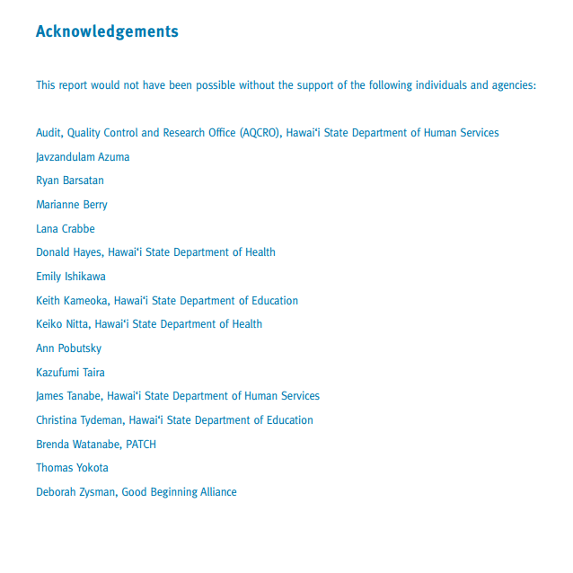
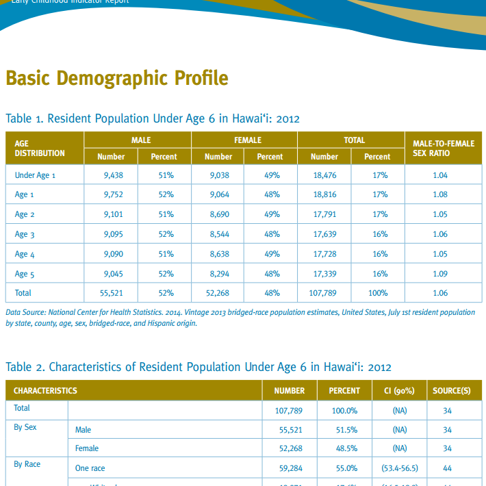

	</img>
	</img>

Center on The Family (COF) released a report on the health and wellness statistics of early childhood (ages 0-5) children. Thie data in this report features COF Indicators that give insights on a variety of issues that an early childhood child living in hawaii could face, and which social services/programs can be changed to better suit their needs. 

My role in this project was in helping clean the raw data coming in from surveys, as well as importing large sets of data into our SQL Server database and calculate/consolidate datapoints for the COF Indicators. Through helping with this report I was able to advance my level knowledge of SQL query language, as well as get hands on experience working with big data. This project was also my first introduction into using VBA to manipulate many .csv and .xlsx files through batch processes.  

Source: [Report PDF](http://uhfamily.hawaii.edu/publications/brochures/caa45_COF_ECISReport_2015_0421.pdf)

