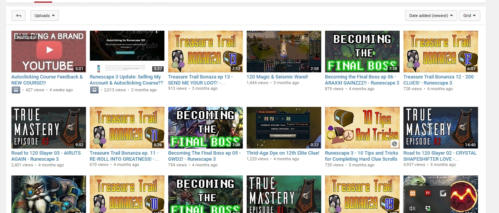
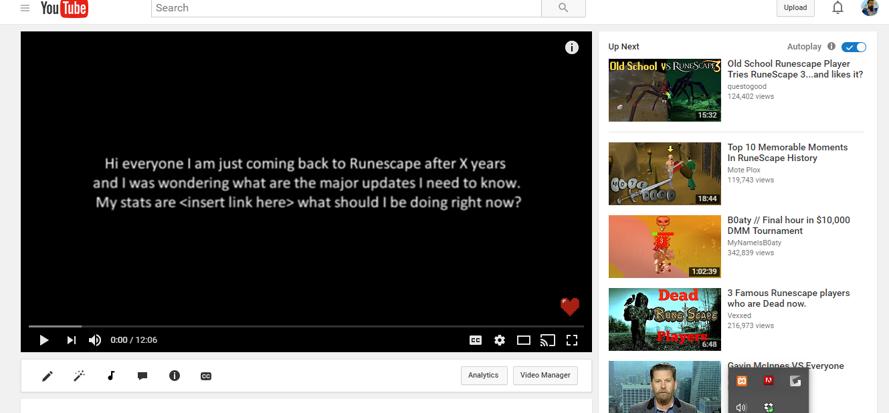

	</img>
	</img>

I started a youtube channel based around the game Runescape, within 6 months I was able to grow the channel from nothing to over 1000 subscribers. 

Although this project is not directly related to Computer Science, and has very little to do with technical skill I think it showcases some unique skills and experience I have that not many think about. One aspect of coding, web design, and building a startup is using user feedback to create a better product. In the end you want the user to be most comfortable and like the product your putting out, this is the same with youtube, you need to know what your viewers like and put out content that they are more likely to watch. Through interacting with them in the comments and on social media you are able to get a feel for what they want in the product, this might be different from what you originaly invisioned and you have to pivot to give the users what they want. Secondly using social media to grow your brand and again connect with people is just as important as creating and coding good software. You can have the best app compared to some other guy but people will gravitate toward the brand they "like" the most. While building this youtube channel I learned how to "talk" to people on the internet, view them as potential customers, and make them view my brand the way I wanted to be perceived. 

Source: [Youtube Channel](https://www.youtube.com/channel/UCvIYb46mCF7TpXFinGNaRtQ)

