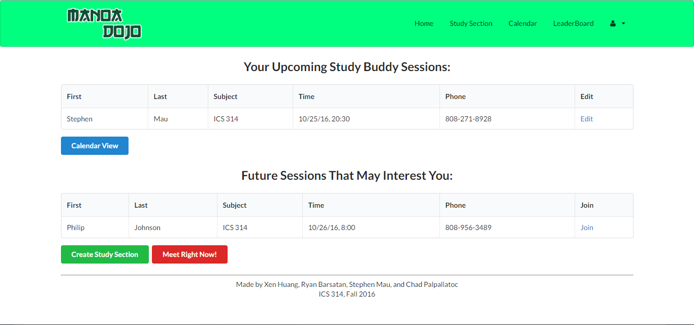

## Summary
Manoa Dojo is a study app that helps students excel in certain classes by matching them up with other students who have already taken that class, or are very knowledgeable in that subject. For each course, there are two types of users: Grasshoppers and Senseis. Grasshoppers represent the typical student users – ones that require help in their classes. Senseis are the student mentors whom have already taken the course. Grasshoppers can request a study session, notifying all other grasshoppers and senseis in that subject. These grasshoppers and senseis may join the study session, creating a study group. We believed that students learned best when in an environment with their peers, Manoa Dojo's goal is to facilitate this and help everyone learn and grow. 

## Contributions
For Manoa Dojo I was in charge of creating the landing page and implementing login functionality. Users needed to login through the University of Hawaii Cas system so that we could authenticate each use as a UHM student or staff. I implemented the calendar function in which sections that you sign up for are displayed on your personal calendar so that you can keep track of upcoming sections. I was also in taking all the photos used in Manoa Dojo as well as creating the graphics for the About Page so that before users logged in they knew what Manoa Dojo was all about in a fun intuitive way. The biggest thing I learned from this project was that it's extremely hard to do a group project without a dedicated leader and plan. Without a clear plan the system for divying out and completing tasks is often haphazard and creates a lot of gaps in knowledge about the functionality of the app and how the pieces fit together, and without a clear leader theres not way to make the plan so it ends up feeling weird. I'm sure these problems are unique to school group projects and not indicitive of how an actual business or company runs its projects.

	</img>
	</img>

Source: [Youtube Channel](https://manoa-dojo.github.io/)

